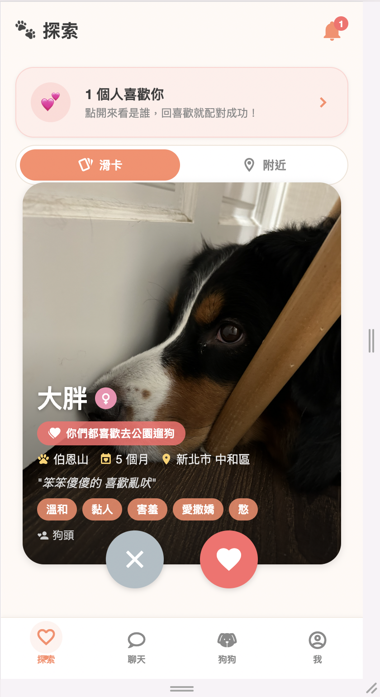
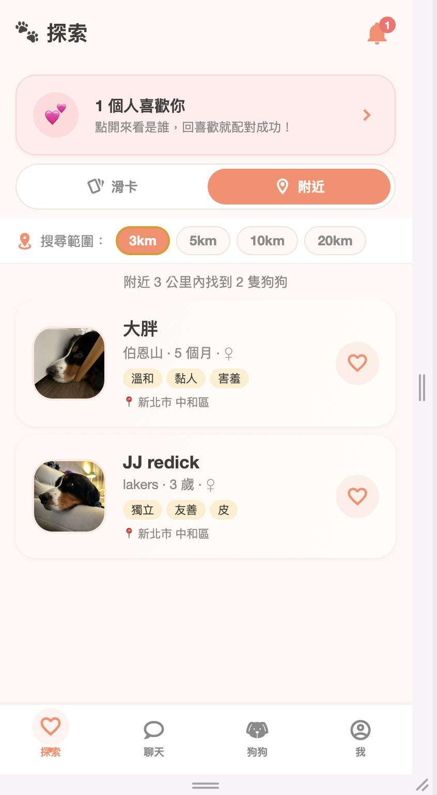
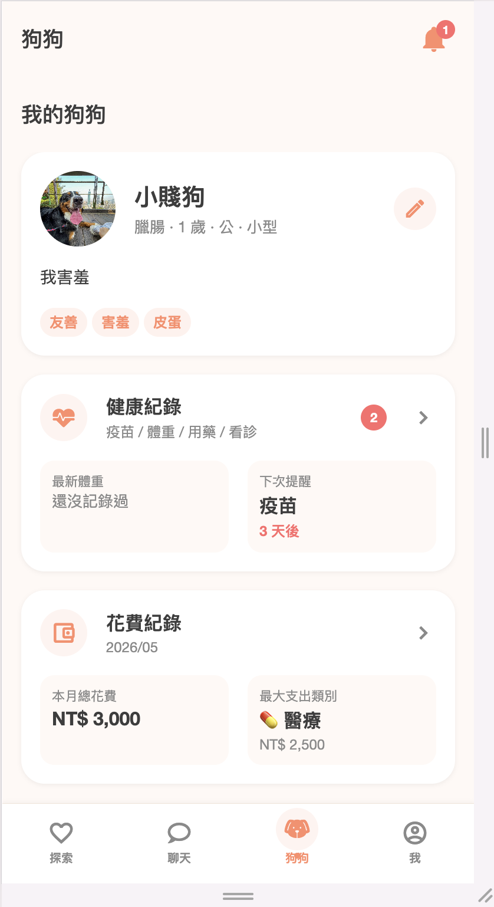
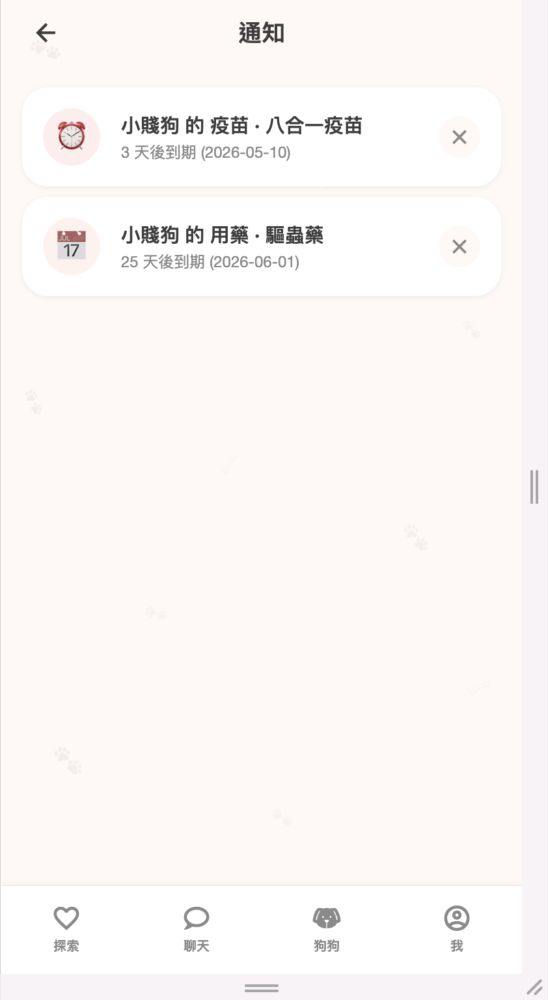
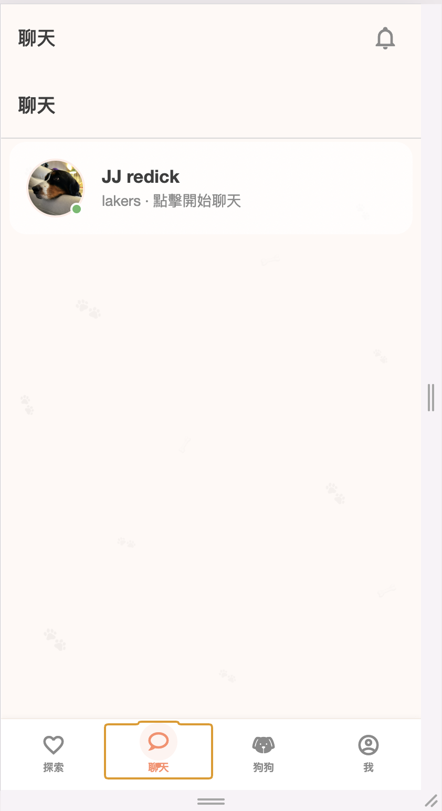
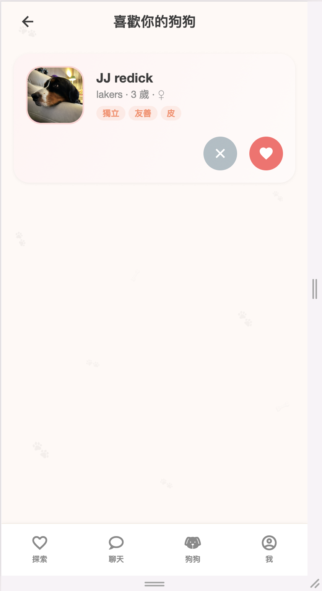

<div align="center">


# 🐾 DogBond

**為養狗的人打造的社交 App — 認識附近狗友、追蹤毛孩健康與開銷**

[](https://expo.dev)
[](https://reactnative.dev)
[](https://supabase.com)
[](https://www.typescriptlang.org)

[隱私權政策](https://kidd-91.github.io/pawmate/legal/privacy/) · [服務條款](https://kidd-91.github.io/pawmate/legal/terms/) · [技術文件](docs/architecture.md) · [視覺化架構](docs/architecture-diagrams.md)

</div>

---

## 📱 介紹

養狗的你，想找有共同話題的朋友嗎？想記錄毛孩的健康，但翻爛了行事曆還是會漏掉疫苗？想知道每月在狗狗身上花了多少？

**DogBond** 把這些事整理在一個 App 裡，讓你和你的毛孩一起認識新朋友、過得更健康。

---

## ✨ 主要功能

| 功能 | 說明 |
|------|------|
| 💕 **滑卡配對** | 為狗狗建立檔案，照片、品種、個性、散步偏好填好，互相喜歡就配對成功 |
| 📍 **附近狗友** | 地圖顯示附近的狗（PostGIS），找到能一起散步的鄰居 |
| 💬 **私訊聊天** | 配對後直接聊天，約散步、交換養狗心得 |
| 🏥 **健康追蹤** | 疫苗、用藥、體重、看診、美容紀錄 + 自動提醒 |
| 💰 **開銷記帳** | 分類記錄毛孩開銷，月底一目瞭然 |
| 🔔 **通知中心** | 喜歡你的人、健康提醒到期，全部聚在鈴鐺裡 |

---

## 🖼 截圖

<div align="center">

| 滑卡配對 | 附近狗友 | 狗狗 Dashboard |
|:---:|:---:|:---:|
|  |  |  |
| **通知中心** | **聊天** | **喜歡你的狗狗** |
|  |  |  |

</div>

---

## 🛠 技術棧

**前端**：React Native 0.81 · Expo SDK 54 · expo-router · TypeScript · zustand · react-native-paper · react-native-maps

**後端**：Express · TypeScript · Supabase (Postgres + PostGIS + Auth + Storage + RLS)

**基礎設施**：Render (API hosting) · EAS (mobile build) · GitHub Pages (legal docs)

**認證**：Email/Password + Google OAuth 2.0

詳細架構請看 [docs/architecture.md](docs/architecture.md) 或 [視覺化版](docs/architecture-diagrams.md)。

---

## 🚀 本地開發

### 必要條件

- Node.js 18+
- npm
- 一份 Supabase 專案的 anon key + service role key

### 啟動步驟

```bash
# 1. clone
git clone https://github.com/kidd-91/pawmate.git
cd pawmate

# 2. 設定環境變數
cp .env.example .env
# 編輯 .env 填入 EXPO_PUBLIC_SUPABASE_URL / EXPO_PUBLIC_SUPABASE_ANON_KEY / EXPO_PUBLIC_API_URL

# 3. 安裝依賴
npm install

# 4. 啟動前端
npx expo start
# 按 w 開 web、按 a 開 Android emulator
```

### 啟動 backend

```bash
cd backend
cp .env.example .env  # 填入 SUPABASE_URL / SUPABASE_SERVICE_ROLE_KEY
npm install
npm run dev
```

---

## 📦 發布到 Google Play

```bash
# 1. bump 版本號（app.json 的 version 和 android.versionCode）
# 2. EAS build
eas build --platform android --profile production
# 3. 下載 .aab 上傳到 Play Console → 送審
```

詳細上架流程見 [docs/architecture.md §11](docs/architecture.md)。

---

## 📂 專案結構

```
.
├── app/                  # expo-router 路由（檔案系統路由）
│   ├── (auth)/           # 登入前畫面
│   └── (tabs)/           # 4 個主 tabs
├── components/           # 可重用 UI 元件
├── stores/               # zustand 全域狀態
├── lib/                  # supabase / googleAuth / api wrapper
├── backend/              # Express API server
│   └── src/routes/       # 10 個 API routes
├── supabase/migrations/  # DB schema 演進史
├── docs/                 # 技術文件 + 法律頁
└── assets/               # icons / splash / Play Store 素材
```

---

## 🔒 隱私與安全

- 資料儲存於 Supabase，傳輸全程 HTTPS 加密
- 全資料表開啟 Row Level Security
- 使用者可隨時 in-app 刪除帳號（CASCADE 連動清光所有資料）
- 詳見 [隱私權政策](https://kidd-91.github.io/pawmate/legal/privacy/)

---

## 📧 聯絡

DogBond 是個獨立開發者的小作品，有任何回饋、bug、想看到的功能，都歡迎寫信來：

**Email**：kidd91.chen@gmail.com
**網站**：https://kidd-91.github.io/pawmate/

---

<div align="center">

🐶 *一起讓你的狗狗多一些朋友吧。*

</div>
