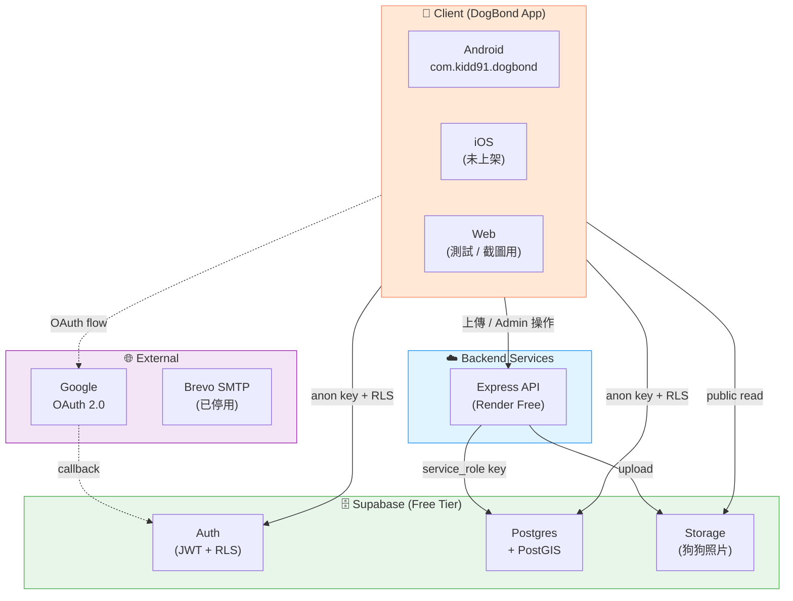
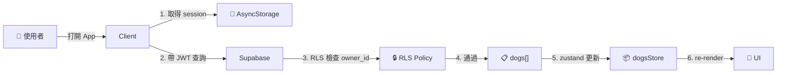
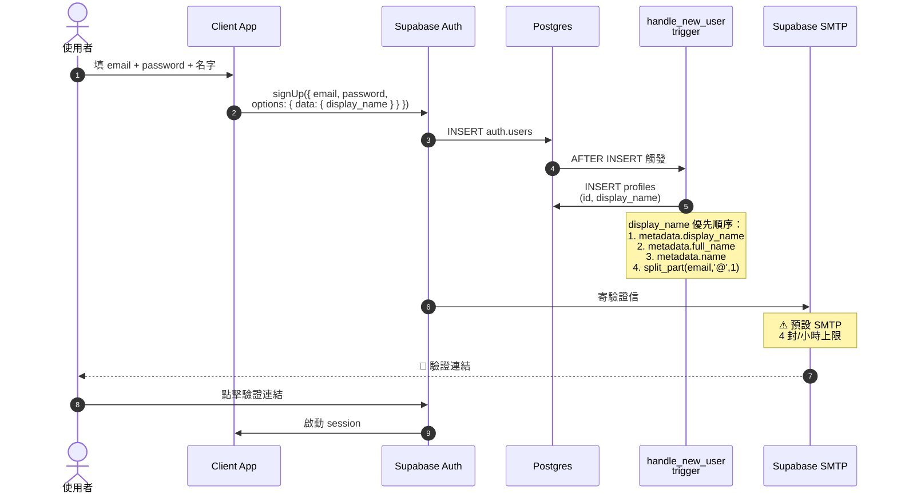
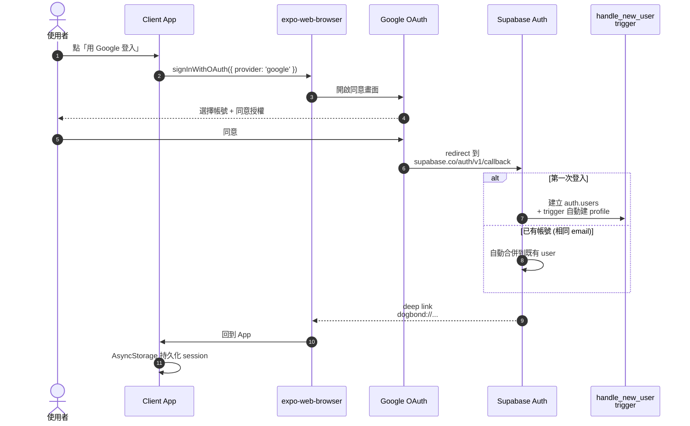
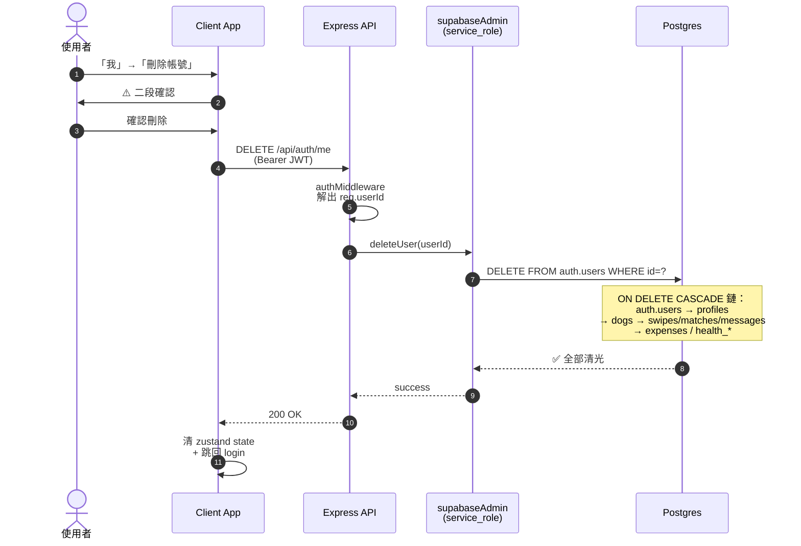
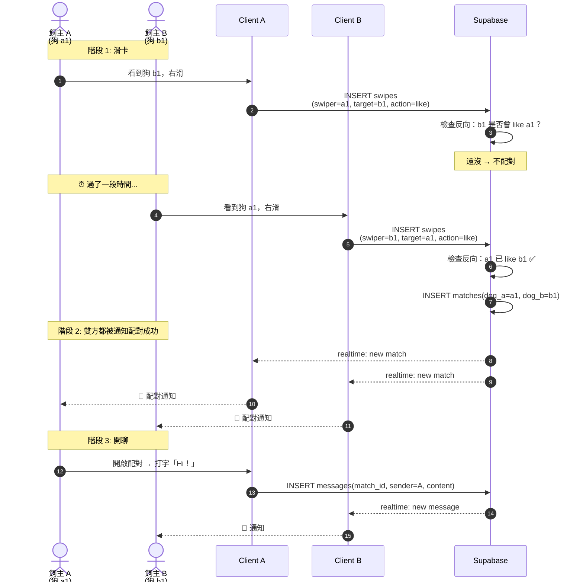
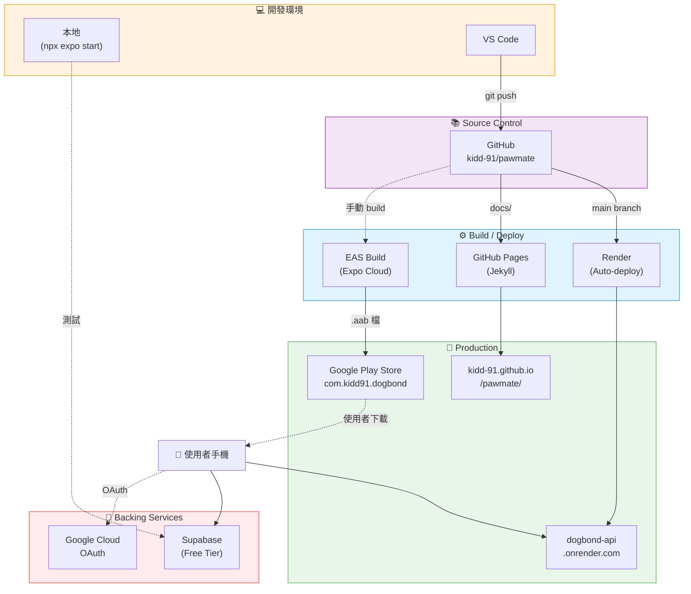
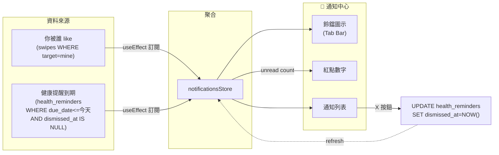
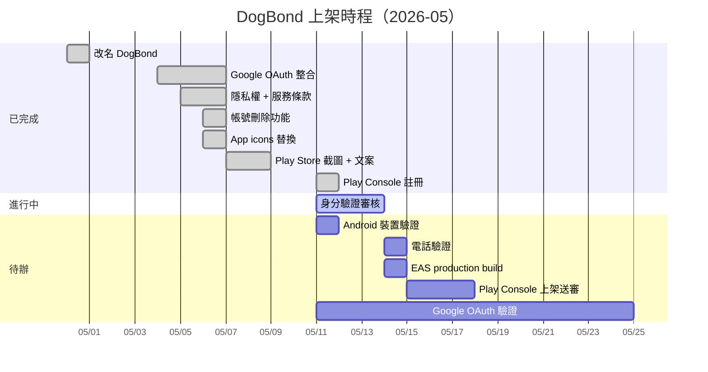
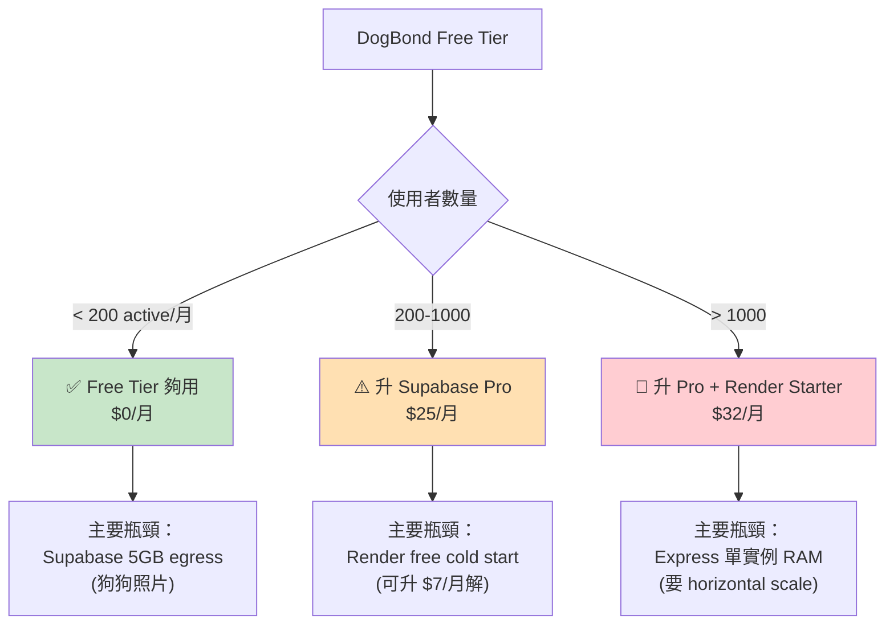

---
# Internal diagrams doc — excluded from GitHub Pages by docs/_config.yml
# 用 mermaid 畫的視覺化架構圖。在 GitHub 上會自動 render。
# 文字版完整文件請看 docs/architecture.md
---

# DogBond 視覺化架構圖

> 這份用 mermaid 語法繪圖，**在 GitHub 上瀏覽**會自動 render 成圖片。
> VS Code 也可以裝 [Markdown Preview Mermaid Support](https://marketplace.visualstudio.com/items?itemName=bierner.markdown-mermaid) 套件來預覽。
> 文字版說明請看 [architecture.md](architecture.md)。

---

## 1. 系統總覽



**重點**：
- Client 大部分**直連 Supabase**（用 anon key + RLS）
- 只有 admin 操作（刪帳號、檔案上傳）走 Express
- Google OAuth 走外部瀏覽器，最後 callback 到 Supabase

---

## 2. 資料流（讀取狗狗清單）



---

## 3. 認證流程

### 3.1 Email + Password 註冊



### 3.2 Google OAuth 登入



### 3.3 帳號刪除（Google Play 2024 政策必要）



---

## 4. 資料庫 ER 圖

```mermaid
erDiagram
    USERS ||--|| PROFILES : "trigger 自動建"
    PROFILES ||--o{ DOGS : "擁有"
    DOGS ||--o{ SWIPES : "swiper"
    DOGS ||--o{ SWIPES : "target"
    DOGS ||--o{ MATCHES : "dog_a"
    DOGS ||--o{ MATCHES : "dog_b"
    MATCHES ||--o{ MESSAGES : "包含"
    DOGS ||--o{ EXPENSES : "記帳"
    DOGS ||--o{ HEALTH_RECORDS : "健康紀錄"
    DOGS ||--o{ HEALTH_REMINDERS : "提醒"

    USERS {
        uuid id PK
        text email
        jsonb raw_user_meta_data
    }
    PROFILES {
        uuid id PK_FK
        text display_name
        text city
        text district
        geography location "PostGIS Point"
    }
    DOGS {
        uuid id PK
        uuid owner_id FK
        text name
        text breed
        int age_months
        text gender
        text size
        text bio
        text[] personality
        text[] photos
    }
    SWIPES {
        uuid id PK
        uuid swiper_dog_id FK
        uuid target_dog_id FK
        text action "like or pass"
        timestamptz created_at
    }
    MATCHES {
        uuid id PK
        uuid dog_a_id FK
        uuid dog_b_id FK
        timestamptz matched_at
    }
    MESSAGES {
        uuid id PK
        uuid match_id FK
        uuid sender_id FK
        text content
        timestamptz sent_at
    }
    EXPENSES {
        uuid id PK
        uuid dog_id FK
        text category
        numeric amount
        date date
    }
    HEALTH_RECORDS {
        uuid id PK
        uuid dog_id FK
        text type
        text title
        date date
    }
    HEALTH_REMINDERS {
        uuid id PK
        uuid dog_id FK
        text type
        text title
        date due_date
        timestamptz dismissed_at "NULL=未關閉"
    }
```

**重點**：
- 全部 ON DELETE CASCADE — 刪 USERS 會把所有資料連動清光
- PROFILES 是 1:1 對 USERS，靠 trigger 自動建立

---

## 5. 滑卡配對 → 聊天 全流程



---

## 6. 部署架構



---

## 7. 通知中心聚合邏輯



---

## 8. 上架流程（Mermaid Gantt）



---

## 9. 容量規劃（單一頁面圖）



---

## 怎麼看這份文件

### 在 GitHub 上看（最佳）
https://github.com/kidd-91/pawmate/blob/main/docs/architecture-diagrams.md
→ 所有 mermaid 圖會自動 render 成漂亮的圖

### 在 VS Code 看
1. 安裝套件：[Markdown Preview Mermaid Support](https://marketplace.visualstudio.com/items?itemName=bierner.markdown-mermaid)
2. 打開這個檔案 → `Cmd+Shift+V` 開啟 preview

### 在其他工具看
- [Mermaid Live Editor](https://mermaid.live/) — 把 ` ```mermaid ` 區塊裡的內容貼進去看
- [Notion](https://notion.so) — 也支援 mermaid code block

---

*文字版完整文件：[architecture.md](architecture.md)*
*最後更新：2026-05-11*
